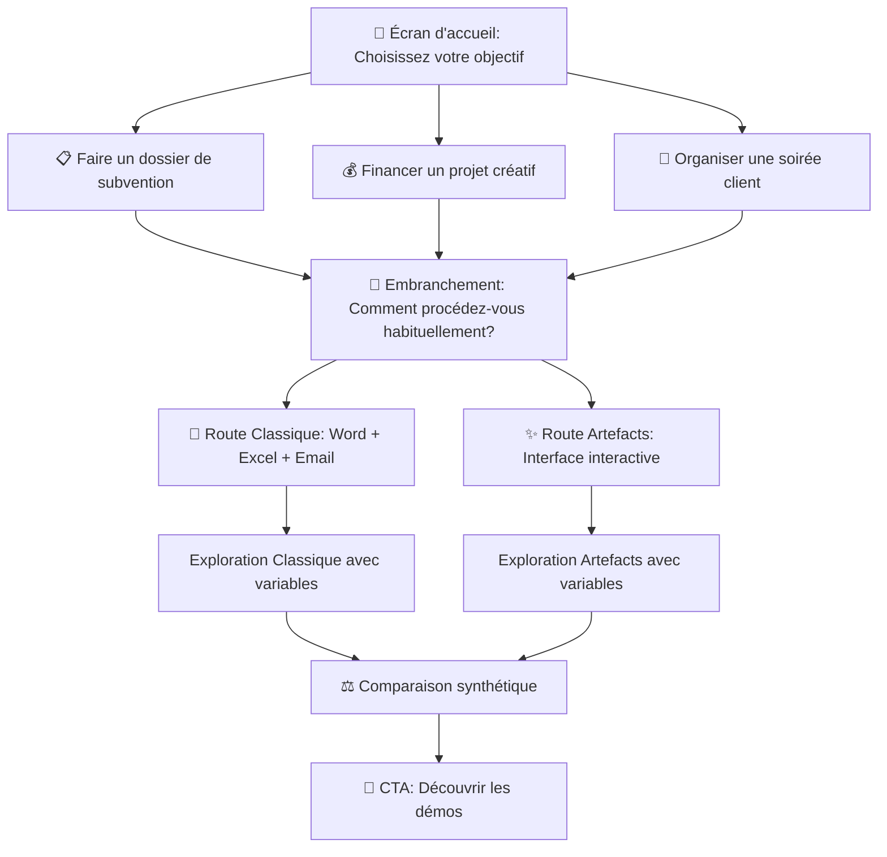

# PRD - Accueil Interactif : Parcours à Embranchements Artefacts vs Méthode Classique
## Product Requirements Document pour Antigravity

---

## 🎯 Vue d'ensemble

### Objectif
Transformer la page d'accueil statique avec toggles en une **expérience narrative interactive organique** qui guide l'utilisateur à travers un parcours de découverte avec embranchements et choix personnalisés.

### Concept central
**"Choisissez votre aventure"** : L'utilisateur part d'un objectif concret (faire un dossier, financer un projet, organiser une soirée) et explore deux chemins parallèles (méthode classique vs artefacts) à travers des **décisions actives** qui influencent son parcours.

### Transformation
- **AVANT** : Toggles statiques qu'il faut ouvrir/fermer pour lire
- **APRÈS** : Parcours narratif gamifié où chaque choix révèle de nouveaux embranchements et insights

---

## 🎨 Design System & Charte Graphique

### Palette Memoways (inchangée)
```css
/* Primaires */
--whale-skin: #515792;
--dark-knight: #171A2F;
--royal-curtsy: #262845;

/* Accents */
--autumn-landscape: #E27227;
--pizazz: #E58441;

/* Neutres */
--skyline: #989AB8;
--desert-field: #EFCFB7;
--coast-cream: #F7E7DB;
```

### Nouveaux styles pour l'interactivité

#### Cartes de choix
```css
.choice-card {
  background: linear-gradient(135deg, #F7E7DB 0%, #FFFFFF 100%);
  border: 3px solid #EFCFB7;
  border-radius: 16px;
  padding: 32px;
  cursor: pointer;
  transition: all 0.4s cubic-bezier(0.4, 0, 0.2, 1);
  position: relative;
  overflow: hidden;
}

.choice-card::before {
  content: '';
  position: absolute;
  top: 0;
  left: -100%;
  width: 100%;
  height: 100%;
  background: linear-gradient(90deg, transparent, rgba(81, 87, 146, 0.1), transparent);
  transition: left 0.6s;
}

.choice-card:hover {
  transform: translateY(-8px) scale(1.02);
  border-color: #515792;
  box-shadow: 0 16px 48px rgba(23, 26, 47, 0.15);
}

.choice-card:hover::before {
  left: 100%;
}

.choice-card.selected {
  border-color: #E27227;
  background: linear-gradient(135deg, #FFFFFF 0%, #F7E7DB 100%);
  box-shadow: 0 8px 32px rgba(226, 114, 39, 0.25);
}
```

#### Chemins de parcours (breadcrumbs visuels)
```css
.journey-path {
  display: flex;
  align-items: center;
  gap: 16px;
  padding: 24px 0;
  margin-bottom: 40px;
  border-bottom: 2px solid #EFCFB7;
}

.path-step {
  display: flex;
  align-items: center;
  gap: 8px;
  padding: 12px 20px;
  background: white;
  border-radius: 24px;
  border: 2px solid #EFCFB7;
  font-size: 14px;
  color: #989AB8;
  transition: all 0.3s;
}

.path-step.active {
  background: linear-gradient(135deg, #E27227 0%, #E58441 100%);
  color: white;
  border-color: transparent;
  font-weight: 700;
}

.path-step.completed {
  border-color: #515792;
  color: #515792;
}

.path-arrow {
  color: #989AB8;
  font-size: 20px;
}
```

#### Révélations progressives (accordéons animés)
```css
.reveal-section {
  background: white;
  border-radius: 12px;
  margin-bottom: 16px;
  overflow: hidden;
  border: 2px solid #EFCFB7;
  transition: all 0.3s;
}

.reveal-section.expanding {
  border-color: #515792;
}

.reveal-header {
  padding: 20px 24px;
  cursor: pointer;
  display: flex;
  justify-content: space-between;
  align-items: center;
  background: linear-gradient(135deg, #F7E7DB 0%, #FFFFFF 100%);
  transition: background 0.3s;
}

.reveal-header:hover {
  background: linear-gradient(135deg, #FFFFFF 0%, #F7E7DB 100%);
}

.reveal-icon {
  font-size: 24px;
  transition: transform 0.4s cubic-bezier(0.4, 0, 0.2, 1);
}

.reveal-section.open .reveal-icon {
  transform: rotate(180deg);
}

.reveal-content {
  max-height: 0;
  overflow: hidden;
  transition: max-height 0.6s cubic-bezier(0.4, 0, 0.2, 1), padding 0.6s;
  padding: 0 24px;
}

.reveal-section.open .reveal-content {
  max-height: 2000px;
  padding: 24px;
}
```

---

## 🗺️ Architecture du Parcours Narratif

### Structure globale (3 niveaux)

```
NIVEAU 1: Point de départ
   ↓
   [Choix d'objectif]
   ↓
NIVEAU 2: Embranchement méthodologique
   ↓
   [Route A: Méthode Classique]  ←→  [Route B: Artefacts]
   ↓                                   ↓
NIVEAU 3: Exploration détaillée avec variables
   ↓
   [Comparaison finale & CTA]
```

### Flux de navigation complet



---

## 📱 Écrans & Composants Détaillés

### Écran 1 : Point de départ - Choix d'objectif

#### Layout
```
┌────────────────────────────────────────────────────┐
│                    [Logo Memoways]                 │
│                                                    │
│         💡 Bienvenue dans l'ère des artefacts     │
│                     interactifs                    │
│                                                    │
│    Fini le temps perdu entre Word, Excel, et mails│
│    Découvrez comment transformer votre processus   │
│                                                    │
│  ┌─────────────┐  ┌─────────────┐  ┌────────────┐│
│  │    📋       │  │    💰       │  │    🎉      ││
│  │ Faire un    │  │ Financer un │  │ Organiser  ││
│  │ dossier     │  │ projet      │  │ une soirée ││
│  │             │  │ créatif     │  │ client     ││
│  └─────────────┘  └─────────────┘  └────────────┘│
│                                                    │
│              [Ou explorez librement ↓]            │
└────────────────────────────────────────────────────┘
```

#### HTML Structure
```html
<section class="hero-start" id="screen-start">
  <div class="container">
    <!-- Logo & Title -->
    <div class="hero-header">
      
      <h1 class="hero-title">
        <span class="title-icon">💡</span>
        Bienvenue dans l'ère des artefacts interactifs
      </h1>
      <p class="hero-subtitle">
        Fini le temps perdu entre Word, Excel, et les mails sans fin.<br>
        Découvrez comment transformer votre processus de travail.
      </p>
    </div>

    <!-- Objective Cards -->
    <div class="objective-cards">
      <div class="choice-card" data-objective="dossier" onclick="selectObjective('dossier')">
        <div class="card-icon">📋</div>
        <h3 class="card-title">Faire un dossier</h3>
        <p class="card-description">
          Dossier de subvention, appel d'offres, ou candidature institutionnelle
        </p>
        <div class="card-badge">→ Découvrir comment</div>
      </div>

      <div class="choice-card" data-objective="financement" onclick="selectObjective('financement')">
        <div class="card-icon">💰</div>
        <h3 class="card-title">Financer un projet</h3>
        <p class="card-description">
          Levée de fonds, recherche de partenaires, plan budgétaire
        </p>
        <div class="card-badge">→ Découvrir comment</div>
      </div>

      <div class="choice-card" data-objective="evenement" onclick="selectObjective('evenement')">
        <div class="card-icon">🎉</div>
        <h3 class="card-title">Organiser une soirée</h3>
        <p class="card-description">
          Soirée client, événement culturel, ou vernissage
        </p>
        <div class="card-badge">→ Découvrir comment</div>
      </div>
    </div>

    <!-- Alternative CTA -->
    <div class="hero-footer">
      <button class="btn-link" onclick="skipToFreeExplore()">
        Ou explorez librement les différences ↓
      </button>
    </div>
  </div>
</section>
```

#### JavaScript Behavior
```javascript
// État global du parcours
const journeyState = {
  currentScreen: 'start',
  selectedObjective: null,
  selectedRoute: null,
  exploredFeatures: [],
  choiceHistory: []
};

// Sélection d'objectif
function selectObjective(objectiveId) {
  // Animation de sélection
  const card = document.querySelector(`[data-objective="${objectiveId}"]`);
  card.classList.add('selected');
  
  // Vibration subtile (si supporté)
  if (navigator.vibrate) {
    navigator.vibrate(50);
  }
  
  // Mise à jour de l'état
  journeyState.selectedObjective = objectiveId;
  journeyState.choiceHistory.push({
    step: 'objective',
    choice: objectiveId,
    timestamp: Date.now()
  });
  
  // Transition vers écran suivant après 600ms
  setTimeout(() => {
    transitionToScreen('fork');
  }, 600);
}

// Transition entre écrans avec animation
function transitionToScreen(screenId) {
  const currentScreen = document.getElementById(`screen-${journeyState.currentScreen}`);
  const nextScreen = document.getElementById(`screen-${screenId}`);
  
  // Fade out current
  currentScreen.style.opacity = '0';
  currentScreen.style.transform = 'translateY(-40px)';
  
  setTimeout(() => {
    currentScreen.style.display = 'none';
    nextScreen.style.display = 'block';
    
    // Fade in next
    setTimeout(() => {
      nextScreen.style.opacity = '1';
      nextScreen.style.transform = 'translateY(0)';
      journeyState.currentScreen = screenId;
      
      // Scroll to top smoothly
      window.scrollTo({ top: 0, behavior: 'smooth' });
    }, 100);
  }, 400);
}
```

---

### Écran 2 : L'embranchement - Route Classique vs Artefacts

#### Contexte dynamique selon objectif
Le texte s'adapte automatiquement selon l'objectif choisi à l'écran 1.

**Exemple pour "Dossier de subvention"** :
```javascript
const contextTexts = {
  dossier: {
    intro: "Pour créer un dossier de subvention, vous avez deux approches possibles.",
    classicTitle: "La méthode habituelle",
    classicDesc: "Word pour le texte, Excel pour le budget, emails pour la collaboration...",
    artefactTitle: "La nouvelle approche par artefacts",
    artefactDesc: "Une interface interactive qui centralise tout et génère le PDF final."
  },
  financement: {
    intro: "Pour préparer un dossier de financement, deux chemins s'offrent à vous.",
    classicTitle: "L'approche traditionnelle",
    classicDesc: "PowerPoint pour les slides, tableaux Excel, documents Word séparés...",
    artefactTitle: "L'approche par artefacts interactifs",
    artefactDesc: "Un espace collaboratif unifié avec simulations en temps réel."
  },
  evenement: {
    intro: "Pour organiser votre soirée client, vous pouvez procéder de deux façons.",
    classicTitle: "La méthode classique",
    classicDesc: "Emails, fichiers Excel partagés, documents Word pour les prestataires...",
    artefactTitle: "La méthode par artefacts",
    artefactDesc: "Un tableau de bord interactif avec simulateur budgétaire temps réel."
  }
};
```

#### Layout
```
┌────────────────────────────────────────────────────────┐
│              [← Retour]    Votre Parcours              │
│   📋 Dossier → 🔀 Choix de méthode                    │
├────────────────────────────────────────────────────────┤
│                                                        │
│  Pour créer un dossier de subvention,                 │
│  vous avez deux approches possibles.                  │
│                                                        │
│  ┌──────────────────────┐  ┌──────────────────────┐  │
│  │  📄 Route A          │  │  ✨ Route B          │  │
│  │  Méthode Classique   │  │  Artefacts           │  │
│  │                      │  │                      │  │
│  │  Word + Excel +      │  │  Interface           │  │
│  │  Emails + PDF        │  │  interactive         │  │
│  │                      │  │  collaborative       │  │
│  │  [Explorer →]        │  │  [Explorer →]        │  │
│  └──────────────────────┘  └──────────────────────┘  │
│                                                        │
│         💡 Conseil: Explorez les deux routes          │
│          pour comparer les approches                  │
│                                                        │
│              [Je préfère comparer directement]        │
└────────────────────────────────────────────────────────┘
```

#### HTML Structure
```html
<section class="fork-screen" id="screen-fork" style="display: none;">
  <div class="container">
    <!-- Breadcrumb / Journey Path -->
    <div class="journey-path">
      <button class="btn-back" onclick="goBack()">← Retour</button>
      <div class="path-step completed">
        <span class="step-icon">📋</span>
        <span id="objective-label">Dossier</span>
      </div>
      <div class="path-arrow">→</div>
      <div class="path-step active">
        <span class="step-icon">🔀</span>
        <span>Choix de méthode</span>
      </div>
    </div>

    <!-- Context Introduction -->
    <div class="fork-intro">
      <h2 id="fork-intro-text" class="fork-title">
        Pour créer un dossier de subvention, vous avez deux approches possibles.
      </h2>
    </div>

    <!-- Routes Cards -->
    <div class="routes-container">
      <!-- Route A: Classique -->
      <div class="route-card" data-route="classic">
        <div class="route-header">
          <span class="route-icon">📄</span>
          <h3 class="route-label">Route A</h3>
        </div>
        <h4 id="classic-title" class="route-title">Méthode Classique</h4>
        <p id="classic-desc" class="route-description">
          Word pour le texte, Excel pour le budget, emails pour la collaboration...
        </p>
        
        <div class="route-preview">
          <div class="preview-item">
            <span class="preview-icon">📝</span>
            <span class="preview-text">Document Word</span>
          </div>
          <div class="preview-item">
            <span class="preview-icon">📊</span>
            <span class="preview-text">Tableur Excel</span>
          </div>
          <div class="preview-item">
            <span class="preview-icon">📧</span>
            <span class="preview-text">Emails de suivi</span>
          </div>
          <div class="preview-item">
            <span class="preview-icon">💾</span>
            <span class="preview-text">Export PDF final</span>
          </div>
        </div>

        <button class="btn-route" onclick="exploreRoute('classic')">
          Explorer cette route →
        </button>
      </div>

      <!-- Route B: Artefacts -->
      <div class="route-card route-highlighted" data-route="artefact">
        <div class="route-badge">✨ Nouveau</div>
        <div class="route-header">
          <span class="route-icon">✨</span>
          <h3 class="route-label">Route B</h3>
        </div>
        <h4 id="artefact-title" class="route-title">Artefacts Interactifs</h4>
        <p id="artefact-desc" class="route-description">
          Une interface interactive qui centralise tout et génère le PDF final.
        </p>
        
        <div class="route-preview">
          <div class="preview-item">
            <span class="preview-icon">🎨</span>
            <span class="preview-text">Interface unifiée</span>
          </div>
          <div class="preview-item">
            <span class="preview-icon">🔄</span>
            <span class="preview-text">Temps réel</span>
          </div>
          <div class="preview-item">
            <span class="preview-icon">👥</span>
            <span class="preview-text">Collaboration intégrée</span>
          </div>
          <div class="preview-item">
            <span class="preview-icon">📄</span>
            <span class="preview-text">Export PDF auto</span>
          </div>
        </div>

        <button class="btn-route btn-primary" onclick="exploreRoute('artefact')">
          Explorer cette route →
        </button>
      </div>
    </div>

    <!-- Alternative CTA -->
    <div class="fork-footer">
      <p class="fork-tip">
        💡 <strong>Conseil :</strong> Explorez les deux routes pour comparer les approches
      </p>
      <button class="btn-link" onclick="transitionToScreen('comparison')">
        Je préfère comparer directement
      </button>
    </div>
  </div>
</section>
```

#### JavaScript pour adaptation contextuelle
```javascript
function initializeForkScreen() {
  const objective = journeyState.selectedObjective;
  const context = contextTexts[objective];
  
  // Mise à jour des textes dynamiques
  document.getElementById('fork-intro-text').textContent = context.intro;
  document.getElementById('objective-label').textContent = 
    objectiveLabels[objective];
  
  // Route A (Classique)
  document.getElementById('classic-title').textContent = context.classicTitle;
  document.getElementById('classic-desc').textContent = context.classicDesc;
  
  // Route B (Artefacts)
  document.getElementById('artefact-title').textContent = context.artefactTitle;
  document.getElementById('artefact-desc').textContent = context.artefactDesc;
}
```

---

### Écran 3A : Exploration Route Classique (avec variables)

#### Concept
L'utilisateur explore la méthode classique à travers un **parcours interactif révélant progressivement les étapes**, avec possibilité d'ajuster des **variables** (nombre de collaborateurs, complexité du dossier, délai) qui influencent les **métriques affichées**.

#### Layout
```
┌──────────────────────────────────────────────────────┐
│  [← Retour]  📋 Dossier → 🔀 Méthode → 📄 Classique │
├──────────────────────────────────────────────────────┤
│                                                      │
│        📄 La méthode classique en détail            │
│                                                      │
│  Voici comment se déroule habituellement votre      │
│  processus avec les outils traditionnels.           │
│                                                      │
│  ┌────────────────────────────────────────────┐    │
│  │ 🎛️ Ajustez vos paramètres                 │    │
│  │                                            │    │
│  │ Collaborateurs: [●─────] 3 personnes      │    │
│  │ Complexité: [──●───] Moyenne               │    │
│  │ Délai: [────●─] 2 semaines                │    │
│  └────────────────────────────────────────────┘    │
│                                                      │
│  ┌─ Étape 1: Rédaction initiale ───────────┐       │
│  │ [Déplier ▼]                              │       │
│  └──────────────────────────────────────────┘       │
│                                                      │
│  ┌─ Étape 2: Collaboration & révisions ────┐       │
│  │ [Déplier ▼]                              │       │
│  └──────────────────────────────────────────┘       │
│                                                      │
│  ┌─ Étape 3: Consolidation budgétaire ─────┐       │
│  │ [Déplier ▼]                              │       │
│  └──────────────────────────────────────────┘       │
│                                                      │
│  [Plus d'étapes...]                                 │
│                                                      │
│  ┌──────────────────────────────────┐              │
│  │ 📊 Métriques calculées           │              │
│  │                                  │              │
│  │ ⏱️ Temps total: ~18 heures       │              │
│  │ 📧 Emails échangés: ~45          │              │
│  │ 💾 Versions: ~12 fichiers        │              │
│  │ 😰 Niveau de stress: Élevé       │              │
│  └──────────────────────────────────┘              │
│                                                      │
│  [Comparer avec les artefacts →]                   │
└──────────────────────────────────────────────────────┘
```

#### Étapes détaillées (contenu des accordéons)

##### Étape 1: Rédaction initiale
```html
<div class="reveal-section" data-step="1">
  <div class="reveal-header" onclick="toggleReveal(this)">
    <div>
      <h4>📝 Étape 1 : Rédaction initiale</h4>
      <p class="step-duration">Durée estimée: 4-6 heures</p>
    </div>
    <span class="reveal-icon">▼</span>
  </div>
  <div class="reveal-content">
    <div class="step-details">
      <!-- Outils utilisés -->
      <div class="tools-section">
        <h5>🛠️ Outils utilisés</h5>
        <div class="tool-tags">
          <span class="tool-tag">Microsoft Word</span>
          <span class="tool-tag">Google Docs</span>
        </div>
      </div>

      <!-- Actions concrètes -->
      <div class="actions-section">
        <h5>✓ Actions concrètes</h5>
        <ul class="actions-list">
          <li>Ouvrir un document Word vierge</li>
          <li>Rechercher un modèle ou une trame existante</li>
          <li>Rédiger le contenu section par section</li>
          <li>Sauvegarder avec un nom de fichier explicite</li>
          <li>Première relecture personnelle</li>
        </ul>
      </div>

      <!-- Points de friction -->
      <div class="friction-section">
        <h5>⚠️ Points de friction courants</h5>
        <div class="friction-item">
          <span class="friction-icon">🔍</span>
          <span class="friction-text">Difficulté à retrouver la dernière version du modèle</span>
        </div>
        <div class="friction-item">
          <span class="friction-icon">💭</span>
          <span class="friction-text">Incertitude sur le niveau de détail requis</span>
        </div>
        <div class="friction-item">
          <span class="friction-icon">📁</span>
          <span class="friction-text">Organisation des fichiers brouillons</span>
        </div>
      </div>

      <!-- Avantages -->
      <div class="benefits-section">
        <h5>✅ Avantages de cette approche</h5>
        <div class="benefit-item">
          <span class="benefit-icon">👤</span>
          <span class="benefit-text">Contrôle total sur la rédaction</span>
        </div>
        <div class="benefit-item">
          <span class="benefit-icon">💻</span>
          <span class="benefit-text">Travail hors ligne possible</span>
        </div>
        <div class="benefit-item">
          <span class="benefit-icon">📋</span>
          <span class="benefit-text">Format familier et maîtrisé</span>
        </div>
      </div>
    </div>
  </div>
</div>
```

##### Étape 2: Collaboration & révisions
```html
<div class="reveal-section" data-step="2">
  <div class="reveal-header" onclick="toggleReveal(this)">
    <div>
      <h4>👥 Étape 2 : Collaboration & révisions</h4>
      <p class="step-duration">Durée estimée: 6-8 heures réparties sur 5-7 jours</p>
    </div>
    <span class="reveal-icon">▼</span>
  </div>
  <div class="reveal-content">
    <div class="step-details">
      <div class="tools-section">
        <h5>🛠️ Outils utilisés</h5>
        <div class="tool-tags">
          <span class="tool-tag">Email</span>
          <span class="tool-tag">WhatsApp</span>
          <span class="tool-tag">Commentaires Word</span>
          <span class="tool-tag">Suivi des modifications</span>
        </div>
      </div>

      <div class="actions-section">
        <h5>✓ Actions concrètes</h5>
        <ul class="actions-list">
          <li>Envoyer le fichier par email aux collaborateurs</li>
          <li>Attendre les retours (relances nécessaires)</li>
          <li>Recevoir 3-4 versions modifiées différentes</li>
          <li>Comparer manuellement les modifications</li>
          <li>Consolider dans une version "finale_v1"</li>
          <li>Re-partager pour validation</li>
          <li>Nouveau cycle de modifications...</li>
        </ul>
      </div>

      <div class="friction-section">
        <h5>⚠️ Points de friction courants</h5>
        <div class="friction-item">
          <span class="friction-icon">🔄</span>
          <span class="friction-text">Versions multiples en conflit (finale_v1, finale_v2_ulrich, finale_VRAIE_VERSION...)</span>
        </div>
        <div class="friction-item">
          <span class="friction-icon">⏰</span>
          <span class="friction-text">Délais de réponse imprévisibles</span>
        </div>
        <div class="friction-item">
          <span class="friction-icon">📧</span>
          <span class="friction-text">Fils d'emails interminables et confus</span>
        </div>
        <div class="friction-item">
          <span class="friction-icon">🤔</span>
          <span class="friction-text">Difficile de savoir qui a validé quoi</span>
        </div>
      </div>

      <div class="benefits-section">
        <h5>✅ Avantages de cette approche</h5>
        <div class="benefit-item">
          <span class="benefit-icon">💬</span>
          <span class="benefit-text">Communication riche par email et messages</span>
        </div>
        <div class="benefit-item">
          <span class="benefit-icon">📝</span>
          <span class="benefit-text">Commentaires contextuels dans le document</span>
        </div>
        <div class="benefit-item">
          <span class="benefit-icon">📂</span>
          <span class="benefit-text">Historique des versions sauvegardées localement</span>
        </div>
      </div>
    </div>
  </div>
</div>
```

##### Étape 3: Consolidation budgétaire
```html
<div class="reveal-section" data-step="3">
  <div class="reveal-header" onclick="toggleReveal(this)">
    <div>
      <h4>📊 Étape 3 : Consolidation budgétaire</h4>
      <p class="step-duration">Durée estimée: 3-5 heures</p>
    </div>
    <span class="reveal-icon">▼</span>
  </div>
  <div class="reveal-content">
    <div class="step-details">
      <div class="tools-section">
        <h5>🛠️ Outils utilisés</h5>
        <div class="tool-tags">
          <span class="tool-tag">Microsoft Excel</span>
          <span class="tool-tag">Google Sheets</span>
          <span class="tool-tag">Calculatrice</span>
        </div>
      </div>

      <div class="actions-section">
        <h5>✓ Actions concrètes</h5>
        <ul class="actions-list">
          <li>Créer ou récupérer un modèle de budget Excel</li>
          <li>Saisir manuellement tous les postes de dépenses</li>
          <li>Vérifier les formules de calcul (totaux, sous-totaux)</li>
          <li>Ajuster les montants après discussion</li>
          <li>Créer un graphique pour la visualisation</li>
          <li>Exporter en PDF pour intégration au dossier Word</li>
        </ul>
      </div>

      <div class="friction-section">
        <h5>⚠️ Points de friction courants</h5>
        <div class="friction-item">
          <span class="friction-icon">🔢</span>
          <span class="friction-text">Erreurs de saisie manuelle des chiffres</span>
        </div>
        <div class="friction-item">
          <span class="friction-icon">🔗</span>
          <span class="friction-text">Pas de lien dynamique entre budget et texte du dossier</span>
        </div>
        <div class="friction-item">
          <span class="friction-icon">📊</span>
          <span class="friction-text">Graphiques à refaire si changements majeurs</span>
        </div>
        <div class="friction-item">
          <span class="friction-icon">💾</span>
          <span class="friction-text">Export PDF à refaire à chaque modification</span>
        </div>
      </div>

      <div class="benefits-section">
        <h5>✅ Avantages de cette approche</h5>
        <div class="benefit-item">
          <span class="benefit-icon">📊</span>
          <span class="benefit-text">Flexibilité totale dans la mise en forme du tableau</span>
        </div>
        <div class="benefit-item">
          <span class="benefit-icon">🎨</span>
          <span class="benefit-text">Contrôle précis sur les graphiques</span>
        </div>
        <div class="benefit-item">
          <span class="benefit-icon">💾</span>
          <span class="benefit-text">Fichier Excel réutilisable pour futurs projets</span>
        </div>
      </div>
    </div>
  </div>
</div>
```

##### Étapes 4-7 (résumé)
```javascript
const additionalSteps = [
  {
    id: 4,
    icon: '🖼️',
    title: 'Mise en forme & visuels',
    duration: '2-3 heures',
    summary: 'Recherche de visuels, mise en page, ajustements typographiques...'
  },
  {
    id: 5,
    icon: '✅',
    title: 'Validation interne finale',
    duration: '1-2 jours',
    summary: 'Dernières lectures, corrections, validation de la direction...'
  },
  {
    id: 6,
    icon: '📎',
    title: 'Compilation des annexes',
    duration: '2-4 heures',
    summary: 'Rassembler justificatifs, lettres de soutien, documents légaux...'
  },
  {
    id: 7,
    icon: '📤',
    title: 'Export PDF & envoi',
    duration: '1-2 heures',
    summary: 'Génération PDF, vérification, compression si nécessaire, envoi...'
  }
];
```

#### Composant des variables (sliders)
```html
<div class="variables-panel">
  <h4>🎛️ Ajustez vos paramètres</h4>
  <p class="variables-intro">
    Ces variables influencent les métriques affichées ci-dessous.
  </p>

  <!-- Slider 1: Nombre de collaborateurs -->
  <div class="variable-group">
    <label for="collab-slider">
      👥 Nombre de collaborateurs
      <span class="variable-value" id="collab-value">3 personnes</span>
    </label>
    <input 
      type="range" 
      id="collab-slider" 
      min="1" 
      max="10" 
      value="3" 
      class="slider"
      oninput="updateMetrics()"
    >
    <div class="slider-labels">
      <span>1</span>
      <span>5</span>
      <span>10</span>
    </div>
  </div>

  <!-- Slider 2: Complexité -->
  <div class="variable-group">
    <label for="complexity-slider">
      🎯 Complexité du dossier
      <span class="variable-value" id="complexity-value">Moyenne</span>
    </label>
    <input 
      type="range" 
      id="complexity-slider" 
      min="1" 
      max="5" 
      value="3" 
      class="slider"
      oninput="updateMetrics()"
    >
    <div class="slider-labels">
      <span>Simple</span>
      <span>Moyenne</span>
      <span>Complexe</span>
    </div>
  </div>

  <!-- Slider 3: Délai -->
  <div class="variable-group">
    <label for="deadline-slider">
      ⏰ Délai disponible
      <span class="variable-value" id="deadline-value">2 semaines</span>
    </label>
    <input 
      type="range" 
      id="deadline-slider" 
      min="1" 
      max="8" 
      value="2" 
      class="slider"
      oninput="updateMetrics()"
    >
    <div class="slider-labels">
      <span>1 sem.</span>
      <span>4 sem.</span>
      <span>8 sem.</span>
    </div>
  </div>
</div>
```

#### Panneau de métriques dynamiques
```html
<div class="metrics-panel">
  <h4>📊 Métriques calculées</h4>
  
  <div class="metrics-grid">
    <div class="metric-card">
      <div class="metric-icon">⏱️</div>
      <div class="metric-value" id="metric-time">~18 heures</div>
      <div class="metric-label">Temps total investi</div>
    </div>

    <div class="metric-card">
      <div class="metric-icon">📧</div>
      <div class="metric-value" id="metric-emails">~45</div>
      <div class="metric-label">Emails échangés</div>
    </div>

    <div class="metric-card">
      <div class="metric-icon">💾</div>
      <div class="metric-value" id="metric-versions">~12 fichiers</div>
      <div class="metric-label">Versions créées</div>
    </div>

    <div class="metric-card">
      <div class="metric-icon">😰</div>
      <div class="metric-value" id="metric-stress">Élevé</div>
      <div class="metric-label">Niveau de stress</div>
    </div>

    <div class="metric-card">
      <div class="metric-icon">🔄</div>
      <div class="metric-value" id="metric-context-switch">~30</div>
      <div class="metric-label">Changements de contexte</div>
    </div>

    <div class="metric-card">
      <div class="metric-icon">🐛</div>
      <div class="metric-value" id="metric-errors">~5-7</div>
      <div class="metric-label">Erreurs / incohérences</div>
    </div>
  </div>

  <div class="metrics-footer">
    <p class="metrics-note">
      💡 Ces métriques sont basées sur des moyennes observées avec nos clients. 
      Vos résultats peuvent varier selon votre contexte.
    </p>
  </div>
</div>
```

#### JavaScript pour calcul dynamique des métriques
```javascript
function updateMetrics() {
  const collabCount = parseInt(document.getElementById('collab-slider').value);
  const complexity = parseInt(document.getElementById('complexity-slider').value);
  const deadline = parseInt(document.getElementById('deadline-slider').value);
  
  // Mise à jour des labels de valeurs
  document.getElementById('collab-value').textContent = 
    `${collabCount} personne${collabCount > 1 ? 's' : ''}`;
  
  const complexityLabels = ['Simple', 'Plutôt simple', 'Moyenne', 'Plutôt complexe', 'Complexe'];
  document.getElementById('complexity-value').textContent = 
    complexityLabels[complexity - 1];
  
  document.getElementById('deadline-value').textContent = 
    `${deadline} semaine${deadline > 1 ? 's' : ''}`;
  
  // Calculs des métriques (formules simplifiées)
  const baseTime = 10; // heures de base
  const timePerCollab = 2;
  const timePerComplexity = 3;
  const totalTime = baseTime + (collabCount * timePerCollab) + (complexity * timePerComplexity);
  
  const baseEmails = 20;
  const emailsPerCollab = 8;
  const totalEmails = baseEmails + (collabCount * emailsPerCollab);
  
  const baseVersions = 5;
  const versionsPerCollab = 2;
  const totalVersions = baseVersions + (collabCount * versionsPerCollab);
  
  const stressLevels = ['Faible', 'Modéré', 'Moyen', 'Élevé', 'Très élevé'];
  const stressIndex = Math.min(
    4,
    Math.floor((collabCount / 3) + (complexity / 2) + (1 / (deadline / 4)))
  );
  const stressLevel = stressLevels[stressIndex];
  
  const contextSwitches = Math.floor(totalTime * 1.5);
  const errors = Math.floor(2 + (complexity * 1.2) + (collabCount * 0.5));
  
  // Mise à jour affichage avec animation
  animateMetricUpdate('metric-time', `~${totalTime} heures`);
  animateMetricUpdate('metric-emails', `~${totalEmails}`);
  animateMetricUpdate('metric-versions', `~${totalVersions} fichiers`);
  animateMetricUpdate('metric-stress', stressLevel);
  animateMetricUpdate('metric-context-switch', `~${contextSwitches}`);
  animateMetricUpdate('metric-errors', `~${errors - 2}-${errors}`);
}

function animateMetricUpdate(elementId, newValue) {
  const element = document.getElementById(elementId);
  element.style.transform = 'scale(1.1)';
  element.style.color = '#E27227';
  
  setTimeout(() => {
    element.textContent = newValue;
  }, 150);
  
  setTimeout(() => {
    element.style.transform = 'scale(1)';
    element.style.color = '';
  }, 300);
}
```

---

### Écran 3B : Exploration Route Artefacts (avec variables)

#### Concept
Structure similaire à 3A mais adaptée pour présenter l'approche par artefacts. Les mêmes variables permettent de calculer des métriques **comparatives** montrant les gains.

#### Layout
```
┌──────────────────────────────────────────────────────┐
│  [← Retour]  📋 Dossier → 🔀 Méthode → ✨ Artefacts │
├──────────────────────────────────────────────────────┤
│                                                      │
│        ✨ La méthode par artefacts en détail        │
│                                                      │
│  Découvrez comment une interface interactive        │
│  transforme votre processus de travail.             │
│                                                      │
│  ┌────────────────────────────────────────────┐    │
│  │ 🎛️ Ajustez vos paramètres (identiques)    │    │
│  │ [Sliders identiques à l'écran 3A]         │    │
│  └────────────────────────────────────────────┘    │
│                                                      │
│  ┌─ Étape 1: Configuration initiale ────────┐      │
│  │ [Déplier ▼]                               │      │
│  └───────────────────────────────────────────┘      │
│                                                      │
│  ┌─ Étape 2: Remplissage collaboratif ──────┐      │
│  │ [Déplier ▼]                               │      │
│  └───────────────────────────────────────────┘      │
│                                                      │
│  ┌─ Étape 3: Ajustements temps réel ────────┐      │
│  │ [Déplier ▼]                               │      │
│  └───────────────────────────────────────────┘      │
│                                                      │
│  [Plus d'étapes...]                                 │
│                                                      │
│  ┌──────────────────────────────────┐              │
│  │ 📊 Métriques calculées           │              │
│  │                                  │              │
│  │ ⏱️ Temps total: ~8 heures        │              │
│  │    ↓ -56% vs classique           │              │
│  │ 💬 Conversations: ~12            │              │
│  │    ↓ -73% vs emails              │              │
│  │ 💾 Versions: 1 seul artefact     │              │
│  │    ↓ -92% vs fichiers multiples  │              │
│  │ 😊 Niveau de stress: Faible      │              │
│  │    ↓ Bien mieux !                │              │
│  └──────────────────────────────────┘              │
│                                                      │
│  [Comparer les deux approches →]                   │
└──────────────────────────────────────────────────────┘
```

#### Étapes détaillées (artefacts)

##### Étape 1: Configuration initiale
```html
<div class="reveal-section" data-step="1">
  <div class="reveal-header" onclick="toggleReveal(this)">
    <div>
      <h4>⚙️ Étape 1 : Configuration initiale de l'artefact</h4>
      <p class="step-duration">Durée estimée: 30 minutes</p>
    </div>
    <span class="reveal-icon">▼</span>
  </div>
  <div class="reveal-content">
    <div class="step-details">
      <div class="tools-section">
        <h5>🛠️ Outil utilisé</h5>
        <div class="tool-tags">
          <span class="tool-tag tool-highlight">Interface Artefact</span>
        </div>
      </div>

      <div class="actions-section">
        <h5>✓ Actions concrètes</h5>
        <ul class="actions-list">
          <li>Ouvrir l'interface artefact via un lien unique</li>
          <li>Renseigner les informations de base (titre projet, contexte)</li>
          <li>Inviter les collaborateurs par email (accès instantané)</li>
          <li>Choisir un modèle de structure adapté</li>
          <li>L'artefact est prêt, le travail peut commencer</li>
        </ul>
      </div>

      <div class="benefits-section">
        <h5>✅ Avantages immédiats</h5>
        <div class="benefit-item">
          <span class="benefit-icon">⚡</span>
          <span class="benefit-text">Configuration en quelques clics</span>
        </div>
        <div class="benefit-item">
          <span class="benefit-icon">🔗</span>
          <span class="benefit-text">Un seul lien pour tout le monde</span>
        </div>
        <div class="benefit-item">
          <span class="benefit-icon">📋</span>
          <span class="benefit-text">Structure guidée dès le départ</span>
        </div>
        <div class="benefit-item">
          <span class="benefit-icon">💾</span>
          <span class="benefit-text">Sauvegarde automatique permanente</span>
        </div>
      </div>

      <div class="limits-section">
        <h5>⚠️ Limites & prérequis</h5>
        <div class="limit-item">
          <span class="limit-icon">🌐</span>
          <span class="limit-text">Nécessite une connexion internet</span>
        </div>
        <div class="limit-item">
          <span class="limit-icon">📱</span>
          <span class="limit-text">Interface peut nécessiter adaptation mobile</span>
        </div>
      </div>
    </div>
  </div>
</div>
```

##### Étape 2: Remplissage collaboratif
```html
<div class="reveal-section" data-step="2">
  <div class="reveal-header" onclick="toggleReveal(this)">
    <div>
      <h4>👥 Étape 2 : Remplissage collaboratif en temps réel</h4>
      <p class="step-duration">Durée estimée: 3-4 heures</p>
    </div>
    <span class="reveal-icon">▼</span>
  </div>
  <div class="reveal-content">
    <div class="step-details">
      <div class="tools-section">
        <h5>🛠️ Outil utilisé</h5>
        <div class="tool-tags">
          <span class="tool-tag tool-highlight">Interface Artefact (collaborative)</span>
        </div>
      </div>

      <div class="actions-section">
        <h5>✓ Actions concrètes</h5>
        <ul class="actions-list">
          <li>Chaque collaborateur remplit sa section directement</li>
          <li>Modifications visibles en temps réel pour tous</li>
          <li>Commentaires inline contextuels</li>
          <li>Notifications automatiques des changements importants</li>
          <li>Indicateurs visuels de complétion (% avancement)</li>
          <li>Pas de versions multiples ni d'envois de fichiers</li>
        </ul>
      </div>

      <div class="benefits-section">
        <h5>✅ Avantages immédiats</h5>
        <div class="benefit-item">
          <span class="benefit-icon">🔄</span>
          <span class="benefit-text">Synchronisation automatique permanente</span>
        </div>
        <div class="benefit-item">
          <span class="benefit-icon">👁️</span>
          <span class="benefit-text">Visibilité totale sur qui fait quoi</span>
        </div>
        <div class="benefit-item">
          <span class="benefit-icon">💬</span>
          <span class="benefit-text">Commentaires contextuels intégrés</span>
        </div>
        <div class="benefit-item">
          <span class="benefit-icon">📊</span>
          <span class="benefit-text">Progression visible en temps réel</span>
        </div>
        <div class="benefit-item">
          <span class="benefit-icon">🚫</span>
          <span class="benefit-text">Zéro conflit de versions</span>
        </div>
      </div>

      <div class="limits-section">
        <h5>⚠️ Limites & prérequis</h5>
        <div class="limit-item">
          <span class="limit-icon">🤝</span>
          <span class="limit-text">Nécessite une culture collaborative</span>
        </div>
        <div class="limit-item">
          <span class="limit-icon">⚡</span>
          <span class="limit-text">Peut sembler "trop rapide" au début</span>
        </div>
      </div>
    </div>
  </div>
</div>
```

##### Étape 3: Ajustements temps réel
```html
<div class="reveal-section" data-step="3">
  <div class="reveal-header" onclick="toggleReveal(this)">
    <div>
      <h4>🎨 Étape 3 : Ajustements et simulations temps réel</h4>
      <p class="step-duration">Durée estimée: 2-3 heures</p>
    </div>
    <span class="reveal-icon">▼</span>
  </div>
  <div class="reveal-content">
    <div class="step-details">
      <div class="tools-section">
        <h5>🛠️ Outil utilisé</h5>
        <div class="tool-tags">
          <span class="tool-tag tool-highlight">Interface Artefact (avec calculs auto)</span>
        </div>
      </div>

      <div class="actions-section">
        <h5>✓ Actions concrètes</h5>
        <ul class="actions-list">
          <li>Ajuster les chiffres budgétaires avec des sliders</li>
          <li>Visualisation instantanée des impacts (graphiques auto-générés)</li>
          <li>Tester plusieurs scénarios (pessimiste/réaliste/optimiste)</li>
          <li>Les totaux se recalculent automatiquement</li>
          <li>Graphiques et visuels se mettent à jour seuls</li>
          <li>IA suggère des optimisations ou signale des incohérences</li>
        </ul>
      </div>

      <div class="benefits-section">
        <h5>✅ Avantages immédiats</h5>
        <div class="benefit-item">
          <span class="benefit-icon">🔢</span>
          <span class="benefit-text">Calculs automatiques zéro erreur</span>
        </div>
        <div class="benefit-item">
          <span class="benefit-icon">📊</span>
          <span class="benefit-text">Visualisations dynamiques instantanées</span>
        </div>
        <div class="benefit-item">
          <span class="benefit-icon">🎯</span>
          <span class="benefit-text">Scénarios multiples faciles à comparer</span>
        </div>
        <div class="benefit-item">
          <span class="benefit-icon">🤖</span>
          <span class="benefit-text">Suggestions IA contextuelles</span>
        </div>
        <div class="benefit-item">
          <span class="benefit-icon">🔗</span>
          <span class="benefit-text">Cohérence garantie entre sections</span>
        </div>
      </div>

      <div class="limits-section">
        <h5>⚠️ Limites & prérequis</h5>
        <div class="limit-item">
          <span class="limit-icon">🎓</span>
          <span class="limit-text">Courbe d'apprentissage initiale de l'interface</span>
        </div>
        <div class="limit-item">
          <span class="limit-icon">🤖</span>
          <span class="limit-text">Suggestions IA nécessitent validation humaine</span>
        </div>
      </div>
    </div>
  </div>
</div>
```

##### Étapes 4-6 (résumé)
```javascript
const artefactSteps = [
  {
    id: 4,
    icon: '✅',
    title: 'Validation collaborative intégrée',
    duration: '1-2 heures',
    summary: 'Système de validation par rôles, notifications auto, historique des changements...'
  },
  {
    id: 5,
    icon: '🎨',
    title: 'Finalisation visuelle automatisée',
    duration: '30 minutes',
    summary: 'Application automatique de la charte graphique, exports multiples formats...'
  },
  {
    id: 6,
    icon: '📄',
    title: 'Export PDF professionnel',
    duration: '5 minutes',
    summary: 'Génération PDF en un clic avec tous les contenus formatés et visuels intégrés...'
  }
];
```

#### Métriques comparatives (avec gains %)
```html
<div class="metrics-panel metrics-comparison">
  <h4>📊 Métriques calculées (avec comparaison)</h4>
  
  <div class="metrics-grid">
    <div class="metric-card metric-improved">
      <div class="metric-icon">⏱️</div>
      <div class="metric-value" id="metric-artefact-time">~8 heures</div>
      <div class="metric-gain">↓ -56% vs classique</div>
      <div class="metric-label">Temps total investi</div>
    </div>

    <div class="metric-card metric-improved">
      <div class="metric-icon">💬</div>
      <div class="metric-value" id="metric-artefact-messages">~12</div>
      <div class="metric-gain">↓ -73% vs emails</div>
      <div class="metric-label">Conversations nécessaires</div>
    </div>

    <div class="metric-card metric-improved">
      <div class="metric-icon">💾</div>
      <div class="metric-value" id="metric-artefact-versions">1 artefact</div>
      <div class="metric-gain">↓ -92% vs fichiers</div>
      <div class="metric-label">Versions à gérer</div>
    </div>

    <div class="metric-card metric-improved">
      <div class="metric-icon">😊</div>
      <div class="metric-value" id="metric-artefact-stress">Faible</div>
      <div class="metric-gain">Bien mieux !</div>
      <div class="metric-label">Niveau de stress</div>
    </div>

    <div class="metric-card metric-improved">
      <div class="metric-icon">🔄</div>
      <div class="metric-value" id="metric-artefact-context">~5</div>
      <div class="metric-gain">↓ -83% vs classique</div>
      <div class="metric-label">Changements de contexte</div>
    </div>

    <div class="metric-card metric-improved">
      <div class="metric-icon">✅</div>
      <div class="metric-value" id="metric-artefact-errors">~0-1</div>
      <div class="metric-gain">↓ -90% d'erreurs</div>
      <div class="metric-label">Erreurs / incohérences</div>
    </div>
  </div>

  <!-- Nouveaux avantages mesurables -->
  <div class="extra-benefits">
    <h5>✨ Bénéfices supplémentaires</h5>
    <div class="extra-benefit-item">
      <span class="benefit-icon">🤝</span>
      <strong>Transparence totale</strong> : Tout le monde voit l'avancement en temps réel
    </div>
    <div class="extra-benefit-item">
      <span class="benefit-icon">♻️</span>
      <strong>Réutilisabilité</strong> : L'artefact devient un modèle pour les prochains projets
    </div>
    <div class="extra-benefit-item">
      <span class="benefit-icon">📚</span>
      <strong>Mémoire organisationnelle</strong> : L'historique des décisions est traçable
    </div>
  </div>
</div>
```

---

### Écran 4 : Comparaison finale synthétique

#### Layout
```
┌──────────────────────────────────────────────────────────┐
│         ⚖️ Comparaison : Classique vs Artefacts         │
├──────────────────────────────────────────────────────────┤
│                                                          │
│  Voici une synthèse des deux approches basée sur vos    │
│  paramètres (3 collaborateurs, complexité moyenne).     │
│                                                          │
│  ┌────────────────┬─────────────┬─────────────────┐    │
│  │    Critère     │  Classique  │   Artefacts     │    │
│  ├────────────────┼─────────────┼─────────────────┤    │
│  │ ⏱️ Temps       │ ~18h        │ ~8h (-56%)      │    │
│  │ 💬 Messages    │ ~45 emails  │ ~12 msgs (-73%) │    │
│  │ 💾 Fichiers    │ ~12 v.      │ 1 (-92%)        │    │
│  │ 😊 Stress      │ Élevé       │ Faible          │    │
│  │ 🔄 Context     │ ~30         │ ~5 (-83%)       │    │
│  │ 🐛 Erreurs     │ ~5-7        │ ~0-1 (-90%)     │    │
│  │ 👥 Collab.     │ Asynchrone  │ Temps réel      │    │
│  │ 📊 Visuels     │ Manuels     │ Auto-générés    │    │
│  │ ♻️ Réutilis.   │ Moyenne     │ Excellente      │    │
│  │ 🌐 Connexion   │ Optionnelle │ Requise         │    │
│  └────────────────┴─────────────┴─────────────────┘    │
│                                                          │
│  ┌──────────────────────────────────────────────────┐  │
│  │ 🎯 Votre situation                               │  │
│  │                                                  │  │
│  │ Avec vos paramètres actuels:                    │  │
│  │ • 3 collaborateurs                              │  │
│  │ • Complexité moyenne                            │  │
│  │ • Délai de 2 semaines                           │  │
│  │                                                  │  │
│  │ ✨ Les artefacts vous feraient gagner:          │  │
│  │    → ~10 heures de travail                      │  │
│  │    → ~33 emails de moins                        │  │
│  │    → Beaucoup moins de stress                   │  │
│  │    → Une qualité finale supérieure              │  │
│  └──────────────────────────────────────────────────┘  │
│                                                          │
│  [🔄 Ajuster les paramètres]  [✨ Découvrir les démos] │
└──────────────────────────────────────────────────────────┘
```

#### HTML Structure
```html
<section class="comparison-screen" id="screen-comparison" style="display: none;">
  <div class="container">
    <!-- Header -->
    <div class="comparison-header">
      <h2>⚖️ Comparaison : Classique vs Artefacts</h2>
      <p class="comparison-intro">
        Voici une synthèse des deux approches basée sur vos paramètres 
        (<span id="params-summary">3 collaborateurs, complexité moyenne, 2 semaines</span>).
      </p>
    </div>

    <!-- Tableau comparatif -->
    <div class="comparison-table-wrapper">
      <table class="comparison-table">
        <thead>
          <tr>
            <th class="col-criteria">Critère</th>
            <th class="col-classic">📄 Méthode Classique</th>
            <th class="col-artefact">✨ Artefacts Interactifs</th>
          </tr>
        </thead>
        <tbody>
          <tr>
            <td class="criteria-name">⏱️ Temps total</td>
            <td class="value-classic" id="compare-time-classic">~18 heures</td>
            <td class="value-artefact" id="compare-time-artefact">
              ~8 heures
              <span class="gain-badge">-56%</span>
            </td>
          </tr>
          <tr>
            <td class="criteria-name">💬 Communications</td>
            <td class="value-classic" id="compare-messages-classic">~45 emails</td>
            <td class="value-artefact" id="compare-messages-artefact">
              ~12 messages
              <span class="gain-badge">-73%</span>
            </td>
          </tr>
          <tr>
            <td class="criteria-name">💾 Gestion versions</td>
            <td class="value-classic">~12 fichiers</td>
            <td class="value-artefact">
              1 artefact unique
              <span class="gain-badge">-92%</span>
            </td>
          </tr>
          <tr>
            <td class="criteria-name">😊 Niveau de stress</td>
            <td class="value-classic stress-high">Élevé</td>
            <td class="value-artefact stress-low">Faible</td>
          </tr>
          <tr>
            <td class="criteria-name">🔄 Changements contexte</td>
            <td class="value-classic">~30 switch</td>
            <td class="value-artefact">
              ~5 switch
              <span class="gain-badge">-83%</span>
            </td>
          </tr>
          <tr>
            <td class="criteria-name">🐛 Erreurs/Incohérences</td>
            <td class="value-classic">~5-7 erreurs</td>
            <td class="value-artefact">
              ~0-1 erreur
              <span class="gain-badge">-90%</span>
            </td>
          </tr>
          <tr>
            <td class="criteria-name">👥 Mode collaboration</td>
            <td class="value-classic">Asynchrone (emails)</td>
            <td class="value-artefact highlight">Temps réel synchronisé</td>
          </tr>
          <tr>
            <td class="criteria-name">📊 Graphiques/Visuels</td>
            <td class="value-classic">Création manuelle</td>
            <td class="value-artefact highlight">Auto-générés</td>
          </tr>
          <tr>
            <td class="criteria-name">♻️ Réutilisabilité</td>
            <td class="value-classic">Moyenne</td>
            <td class="value-artefact highlight">Excellente (templates)</td>
          </tr>
          <tr>
            <td class="criteria-name">🌐 Connexion requise</td>
            <td class="value-classic positive">Optionnelle</td>
            <td class="value-artefact warning">Nécessaire</td>
          </tr>
        </tbody>
      </table>
    </div>

    <!-- Synthèse personnalisée -->
    <div class="personalized-summary">
      <h3>🎯 Votre situation</h3>
      
      <div class="summary-params">
        <p>Avec vos paramètres actuels :</p>
        <ul class="params-list">
          <li><strong>3 collaborateurs</strong></li>
          <li><strong>Complexité moyenne</strong></li>
          <li><strong>Délai de 2 semaines</strong></li>
        </ul>
      </div>

      <div class="summary-gains">
        <h4>✨ Les artefacts vous feraient gagner :</h4>
        <div class="gains-grid">
          <div class="gain-item">
            <div class="gain-icon">⏱️</div>
            <div class="gain-value" id="gain-time">~10 heures</div>
            <div class="gain-label">de travail économisé</div>
          </div>
          <div class="gain-item">
            <div class="gain-icon">📧</div>
            <div class="gain-value" id="gain-emails">~33 emails</div>
            <div class="gain-label">en moins à gérer</div>
          </div>
          <div class="gain-item">
            <div class="gain-icon">😊</div>
            <div class="gain-value">Beaucoup moins</div>
            <div class="gain-label">de stress ressenti</div>
          </div>
          <div class="gain-item">
            <div class="gain-icon">✨</div>
            <div class="gain-value">Qualité ++</div>
            <div class="gain-label">du résultat final</div>
          </div>
        </div>
      </div>
    </div>

    <!-- CTA -->
    <div class="comparison-cta">
      <button class="btn-secondary" onclick="adjustParametersModal()">
        🔄 Ajuster les paramètres
      </button>
      <button class="btn-primary-large" onclick="transitionToScreen('demos')">
        ✨ Découvrir les démos interactives
      </button>
    </div>

    <!-- Note de bas de page -->
    <div class="comparison-footer">
      <p class="disclaimer">
        💡 Ces estimations sont basées sur l'analyse de dizaines de projets accompagnés par Memoways. 
        Vos résultats réels peuvent varier selon votre contexte spécifique et votre équipe.
      </p>
    </div>
  </div>
</section>
```

---

## 🎮 Interactions & Animations

### Transitions entre écrans
```css
/* Animation de sortie */
.screen-exit {
  animation: slideOutUp 0.4s cubic-bezier(0.4, 0, 0.2, 1) forwards;
}

@keyframes slideOutUp {
  from {
    opacity: 1;
    transform: translateY(0);
  }
  to {
    opacity: 0;
    transform: translateY(-40px);
  }
}

/* Animation d'entrée */
.screen-enter {
  animation: slideInUp 0.6s cubic-bezier(0.4, 0, 0.2, 1) forwards;
}

@keyframes slideInUp {
  from {
    opacity: 0;
    transform: translateY(40px);
  }
  to {
    opacity: 1;
    transform: translateY(0);
  }
}
```

### Hover states pour les cartes de choix
```css
.choice-card {
  transition: all 0.4s cubic-bezier(0.4, 0, 0.2, 1);
}

.choice-card:hover {
  transform: translateY(-8px) scale(1.02);
  box-shadow: 0 16px 48px rgba(23, 26, 47, 0.15);
}

.choice-card:active {
  transform: translateY(-4px) scale(0.98);
}
```

### Animations des métriques
```css
@keyframes metricPulse {
  0%, 100% {
    transform: scale(1);
  }
  50% {
    transform: scale(1.05);
  }
}

.metric-card.updating {
  animation: metricPulse 0.6s ease-in-out;
}
```

---

## 🔧 JavaScript - Architecture & État

### État global de l'application
```javascript
const appState = {
  // Navigation
  currentScreen: 'start',
  screenHistory: ['start'],
  
  // Choix utilisateur
  selectedObjective: null, // 'dossier' | 'financement' | 'evenement'
  exploredRoutes: [], // ['classic', 'artefact']
  
  // Variables paramétrables
  variables: {
    collaborators: 3,
    complexity: 3, // 1-5
    deadline: 2 // en semaines
  },
  
  // Métriques calculées
  metrics: {
    classic: {
      time: 18,
      emails: 45,
      versions: 12,
      stress: 'Élevé',
      contextSwitches: 30,
      errors: 6
    },
    artefact: {
      time: 8,
      messages: 12,
      versions: 1,
      stress: 'Faible',
      contextSwitches: 5,
      errors: 1
    }
  },
  
  // Analytics légers
  analytics: {
    sessionStart: Date.now(),
    interactions: [],
    timeSpentPerScreen: {}
  }
};
```

### Fonctions de navigation principales
```javascript
// Navigation vers un écran
function transitionToScreen(screenId) {
  const currentScreen = document.getElementById(`screen-${appState.currentScreen}`);
  const nextScreen = document.getElementById(`screen-${screenId}`);
  
  if (!nextScreen) {
    console.error(`Screen not found: ${screenId}`);
    return;
  }
  
  // Tracking du temps passé
  trackTimeOnScreen(appState.currentScreen);
  
  // Animation de sortie
  currentScreen.classList.add('screen-exit');
  
  setTimeout(() => {
    currentScreen.style.display = 'none';
    currentScreen.classList.remove('screen-exit');
    
    // Affichage nouvel écran
    nextScreen.style.display = 'block';
    nextScreen.classList.add('screen-enter');
    
    // Scroll to top
    window.scrollTo({ top: 0, behavior: 'smooth' });
    
    // Mise à jour état
    appState.screenHistory.push(screenId);
    appState.currentScreen = screenId;
    
    // Initialisation du nouvel écran si nécessaire
    initializeScreen(screenId);
    
    // Retrait classe animation après fin
    setTimeout(() => {
      nextScreen.classList.remove('screen-enter');
    }, 600);
  }, 400);
}

// Retour en arrière
function goBack() {
  if (appState.screenHistory.length > 1) {
    appState.screenHistory.pop(); // Retirer l'écran actuel
    const previousScreen = appState.screenHistory[appState.screenHistory.length - 1];
    transitionToScreen(previousScreen);
  }
}

// Initialisation spécifique selon l'écran
function initializeScreen(screenId) {
  switch(screenId) {
    case 'fork':
      initializeForkScreen();
      break;
    case 'explore-classic':
      initializeExploreClassic();
      break;
    case 'explore-artefact':
      initializeExploreArtefact();
      break;
    case 'comparison':
      initializeComparison();
      break;
  }
}
```

### Tracking analytics léger
```javascript
function trackInteraction(action, details = {}) {
  appState.analytics.interactions.push({
    timestamp: Date.now(),
    action: action,
    screen: appState.currentScreen,
    ...details
  });
}

function trackTimeOnScreen(screenId) {
  const lastInteraction = appState.analytics.interactions
    .filter(i => i.screen === screenId)
    .pop();
  
  if (lastInteraction) {
    const timeSpent = Date.now() - lastInteraction.timestamp;
    appState.analytics.timeSpentPerScreen[screenId] = 
      (appState.analytics.timeSpentPerScreen[screenId] || 0) + timeSpent;
  }
}

// À appeler périodiquement ou avant de quitter la page
function exportAnalytics() {
  // Optionnel : envoyer à un endpoint pour analyse ultérieure
  console.log('Session Analytics:', appState.analytics);
  
  // Ou stocker localement
  localStorage.setItem('memoways_journey', JSON.stringify(appState.analytics));
}
```

---

## 📊 Système de métriques dynamiques

### Formules de calcul
```javascript
const MetricsCalculator = {
  // Temps total (en heures)
  calculateTime(method, variables) {
    const { collaborators, complexity, deadline } = variables;
    
    if (method === 'classic') {
      const baseTime = 10;
      const collabFactor = 2;
      const complexityFactor = 3;
      const deadlineFactor = deadline < 2 ? 1.5 : (deadline < 4 ? 1 : 0.8);
      
      return Math.round(
        (baseTime + (collaborators * collabFactor) + (complexity * complexityFactor)) 
        * deadlineFactor
      );
    } else {
      // Artefacts
      const baseTime = 4;
      const collabFactor = 0.8;
      const complexityFactor = 1.5;
      
      return Math.round(
        baseTime + (collaborators * collabFactor) + (complexity * complexityFactor)
      );
    }
  },
  
  // Messages/Emails
  calculateMessages(method, variables) {
    const { collaborators, complexity } = variables;
    
    if (method === 'classic') {
      const baseEmails = 20;
      const collabFactor = 8;
      return Math.round(baseEmails + (collaborators * collabFactor));
    } else {
      const baseMessages = 5;
      const collabFactor = 2;
      return Math.round(baseMessages + (collaborators * collabFactor));
    }
  },
  
  // Versions/Fichiers
  calculateVersions(method, variables) {
    const { collaborators, complexity } = variables;
    
    if (method === 'classic') {
      const baseVersions = 5;
      const collabFactor = 2;
      return Math.round(baseVersions + (collaborators * collabFactor));
    } else {
      return 1; // Toujours 1 artefact
    }
  },
  
  // Niveau de stress
  calculateStress(method, variables) {
    const { collaborators, complexity, deadline } = variables;
    const levels = ['Très faible', 'Faible', 'Moyen', 'Élevé', 'Très élevé'];
    
    if (method === 'classic') {
      const stressIndex = Math.min(
        4,
        Math.floor((collaborators / 3) + (complexity / 2) + (4 / deadline))
      );
      return levels[stressIndex];
    } else {
      const stressIndex = Math.min(
        2,
        Math.floor((complexity / 3) + (1 / (deadline / 2)))
      );
      return levels[stressIndex];
    }
  },
  
  // Changements de contexte
  calculateContextSwitches(method, variables) {
    const time = this.calculateTime(method, variables);
    
    if (method === 'classic') {
      return Math.floor(time * 1.5);
    } else {
      return Math.floor(time * 0.6);
    }
  },
  
  // Erreurs
  calculateErrors(method, variables) {
    const { collaborators, complexity } = variables;
    
    if (method === 'classic') {
      const base = 2;
      const collabFactor = 0.5;
      const complexityFactor = 1.2;
      const errors = Math.round(base + (collaborators * collabFactor) + (complexity * complexityFactor));
      return `~${errors - 2}-${errors}`;
    } else {
      const base = 0;
      const complexityFactor = 0.3;
      const errors = Math.round(base + (complexity * complexityFactor));
      return `~${errors}-${errors + 1}`;
    }
  },
  
  // Recalcul complet
  recalculateAll(method, variables) {
    return {
      time: this.calculateTime(method, variables),
      messages: this.calculateMessages(method, variables),
      versions: this.calculateVersions(method, variables),
      stress: this.calculateStress(method, variables),
      contextSwitches: this.calculateContextSwitches(method, variables),
      errors: this.calculateErrors(method, variables)
    };
  }
};

// Fonction appelée lors du changement de sliders
function updateAllMetrics() {
  const variables = appState.variables;
  
  // Recalcul pour les deux méthodes
  appState.metrics.classic = MetricsCalculator.recalculateAll('classic', variables);
  appState.metrics.artefact = MetricsCalculator.recalculateAll('artefact', variables);
  
  // Mise à jour affichage
  updateMetricsDisplay();
}
```

---

## 🎯 Critères de succès

### Mesurables
1. **Engagement** : ≥60% des visiteurs explorent au moins une route complète
2. **Parcours complet** : ≥30% arrivent jusqu'à la comparaison finale
3. **Temps passé** : Moyenne ≥3 minutes sur l'application
4. **Interactions** : Moyenne ≥8 clics/interactions par session

### Qualitatifs
- L'utilisateur comprend intuitivement la différence entre les deux approches
- L'expérience est perçue comme ludique et engageante (pas scolaire)
- Les métriques sont crédibles et pertinentes
- L'utilisateur a envie de découvrir les démos complètes

---

## 📱 Responsive Design

### Breakpoints
```css
/* Mobile first */
.container {
  max-width: 100%;
  padding: 16px;
}

/* Tablet */
@media (min-width: 768px) {
  .container {
    max-width: 720px;
    padding: 24px;
  }
  
  .choice-card {
    flex: 0 0 calc(50% - 12px);
  }
}

/* Desktop */
@media (min-width: 1024px) {
  .container {
    max-width: 960px;
    padding: 40px;
  }
  
  .choice-card {
    flex: 0 0 calc(33.333% - 16px);
  }
  
  .routes-container {
    display: grid;
    grid-template-columns: 1fr 1fr;
    gap: 32px;
  }
}

/* Large desktop */
@media (min-width: 1280px) {
  .container {
    max-width: 1200px;
  }
}
```

---

## 🚀 Instructions pour Antigravity

### 1. Structure des fichiers à générer
```
/
├── index.html (page unique avec tous les écrans)
├── css/
│   ├── styles.css (styles principaux)
│   └── animations.css (animations & transitions)
├── js/
│   ├── app.js (logique principale & état)
│   ├── navigation.js (système de navigation)
│   ├── metrics.js (calculateur de métriques)
│   └── interactions.js (interactions utilisateur)
└── assets/
    └── icons/ (icônes SVG si nécessaire)
```

### 2. Stack technique
- **HTML5** : Sémantique et accessible
- **CSS3** : Avec variables CSS, Grid, Flexbox
- **JavaScript Vanilla** : Pas de frameworks (pour légèreté)
- **Aucune dépendance externe** : Tout en pur HTML/CSS/JS

### 3. Optimisations requises
- **Performance** : Animations à 60fps via GPU (transform, opacity)
- **Accessibilité** : ARIA labels, navigation clavier, contraste suffisant
- **SEO** : Meta tags appropriés, structure sémantique
- **Mobile** : Touch-friendly, tailles de cibles ≥44px

### 4. Ordre de développement suggéré
1. Structure HTML complète de tous les écrans
2. Système de navigation entre écrans
3. Styles CSS de base (layout, couleurs, typo)
4. Écran 1 : Point de départ avec cartes objectifs
5. Écran 2 : Embranchement avec routes
6. Écran 3A : Exploration route classique (accordéons)
7. Écran 3B : Exploration route artefacts (accordéons)
8. Système de variables (sliders) et calcul métriques
9. Écran 4 : Comparaison finale
10. Animations et transitions
11. Responsive design
12. Tests & optimisations

### 5. Points d'attention critiques
⚠️ **Les transitions entre écrans doivent être fluides** (pas de saccades)
⚠️ **Les sliders doivent mettre à jour les métriques en temps réel**
⚠️ **Le contenu des accordéons doit être riche et détaillé**
⚠️ **L'expérience mobile doit être excellente** (touch, scroll)
⚠️ **Tous les textes doivent respecter le ton Memoways**

---

## 🎨 Exemples de contenu à intégrer

### Textes contextuels selon objectif

#### Pour "Dossier de subvention"
```javascript
const dossierTexts = {
  intro: "Pour créer un dossier de subvention, vous avez deux approches possibles.",
  classicRoute: {
    title: "La méthode habituelle",
    description: "Word pour le texte, Excel pour le budget, emails pour la collaboration, puis export PDF final.",
    tools: ["Microsoft Word", "Excel", "Email", "PDF"]
  },
  artefactRoute: {
    title: "La nouvelle approche par artefacts",
    description: "Une interface interactive qui centralise tout : rédaction, budget, collaboration, et génère le PDF automatiquement.",
    tools: ["Interface unifiée", "Collaboration temps réel", "Export auto"]
  }
};
```

#### Pour "Financer un projet"
```javascript
const financementTexts = {
  intro: "Pour préparer un dossier de financement, deux chemins s'offrent à vous.",
  classicRoute: {
    title: "L'approche traditionnelle",
    description: "PowerPoint pour les slides, tableaux Excel, documents Word séparés, multiples allers-retours...",
    tools: ["PowerPoint", "Excel", "Word", "Email", "Réunions"]
  },
  artefactRoute: {
    title: "L'approche par artefacts interactifs",
    description: "Un espace collaboratif unifié avec simulations budgétaires temps réel et export multi-formats.",
    tools: ["Dashboard interactif", "Simulations live", "Exports multiples"]
  }
};
```

---

## 📋 Checklist de validation finale

### Fonctionnalités
- [ ] Navigation fluide entre tous les écrans
- [ ] Bouton retour fonctionnel sur chaque écran
- [ ] Sélection d'objectif déclenche bien la transition
- [ ] Routes A et B sont explorables indépendamment
- [ ] Sliders de variables fonctionnent et mettent à jour les métriques
- [ ] Accordéons s'ouvrent/ferment avec animations
- [ ] Tableau de comparaison affiche les bonnes données
- [ ] CTA finaux redirigent vers les sections appropriées

### Design
- [ ] Palette Memoways respectée partout
- [ ] Typographie (Montserrat/Lato) correcte
- [ ] Espacements cohérents (système 8px)
- [ ] Animations fluides (60fps)
- [ ] Hover states visibles et agréables
- [ ] États actifs/sélectionnés clairement identifiables
- [ ] Icônes et émojis bien alignés
- [ ] Dégradés appliqués où spécifié

### Contenu
- [ ] Tous les textes sont présents et corrects
- [ ] Ton Memoways respecté (playful, caring, conversational)
- [ ] Exemples concrets et pertinents
- [ ] Aucune faute d'orthographe
- [ ] Numéros et statistiques cohérents
- [ ] Labels des sliders clairs
- [ ] Messages d'aide/conseils utiles

### Responsive
- [ ] Mobile (320px-767px) : layout à 1 colonne
- [ ] Tablet (768px-1023px) : layout à 2 colonnes
- [ ] Desktop (1024px+) : layout complet
- [ ] Touch targets ≥44px sur mobile
- [ ] Scrolling fluide sur tous devices
- [ ] Textes lisibles sur petits écrans

### Performance
- [ ] Temps de chargement <2s
- [ ] Animations à 60fps
- [ ] Pas de layout shift au chargement
- [ ] Images optimisées (si utilisées)
- [ ] Code minifié pour production

### Accessibilité
- [ ] Navigation clavier fonctionnelle
- [ ] ARIA labels sur éléments interactifs
- [ ] Contraste suffisant (WCAG AA)
- [ ] Focus visible
- [ ] Formulaires accessibles

---

## 🎯 Call-to-Actions finaux

### Depuis l'écran de comparaison
```html
<div class="final-cta">
  <h3>Prêt·e à transformer votre façon de travailler ?</h3>
  
  <div class="cta-buttons">
    <button class="btn-primary-large" onclick="goToDemos()">
      ✨ Essayer les démos interactives
    </button>
    
    <button class="btn-secondary" onclick="goToContact()">
      💬 Discuter avec Memoways
    </button>
  </div>
  
  <p class="cta-reassurance">
    Pas de vente forcée. Juste une discussion sur vos besoins réels.
  </p>
</div>
```

---

## 📞 Support & Maintenance

### Points de contact
- **Questions techniques** : [lien vers section FAQ ou contact]
- **Feedback** : [lien vers formulaire de feedback]
- **Bugs** : [lien vers système de reporting]

### Évolutions futures possibles
1. **Sauvegarde du parcours** : Permettre de reprendre où on s'est arrêté
2. **Partage du résultat** : Générer un lien unique avec sa config personnalisée
3. **Comparaison multi-scénarios** : Comparer 3-4 configurations différentes côte à côte
4. **Export PDF de la comparaison** : Télécharger la synthèse personnalisée
5. **Intégration calculateur ROI** : Convertir les gains temps en valeur monétaire
6. **Témoignages clients** : Intégrer des quotes selon le parcours choisi

---

**Document créé** : Novembre 2025  
**Auteur** : Ulrich Fischer (Memoways) avec assistance Claude  
**Version** : 1.0  
**Statut** : Prêt pour implémentation Antigravity  

---

## 🚀 Livrable final attendu

Une page HTML unique, responsive, avec JavaScript vanilla, qui offre une **expérience narrative interactive organique** permettant aux visiteurs de comprendre viscéralement la différence entre méthode classique et artefacts, à travers un parcours gamifié avec choix, variables, et révélations progressives.

**Le succès se mesure ainsi** : Si après 5 minutes sur cette page, le visiteur a compris pourquoi les artefacts sont une révolution, et a envie de voir les démos concrètes, alors mission accomplie. ✨
